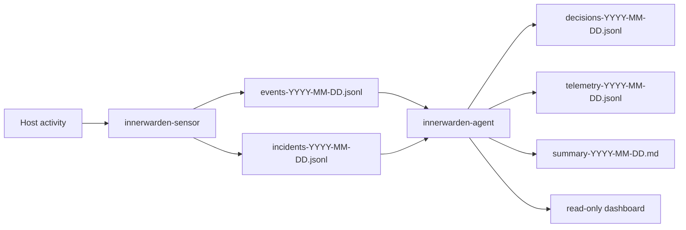
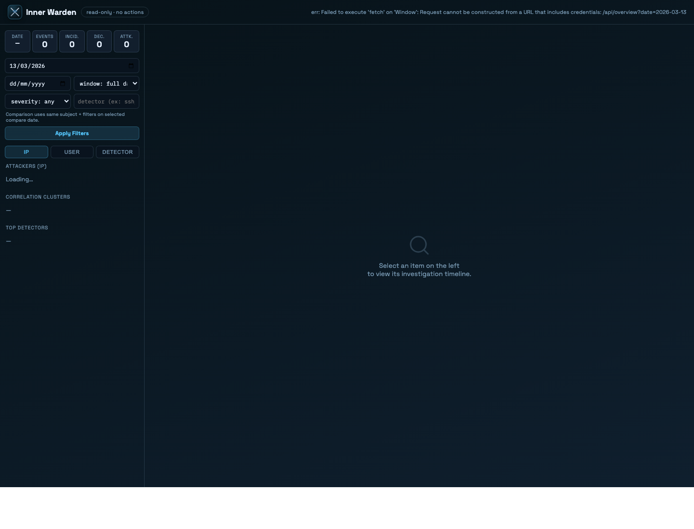
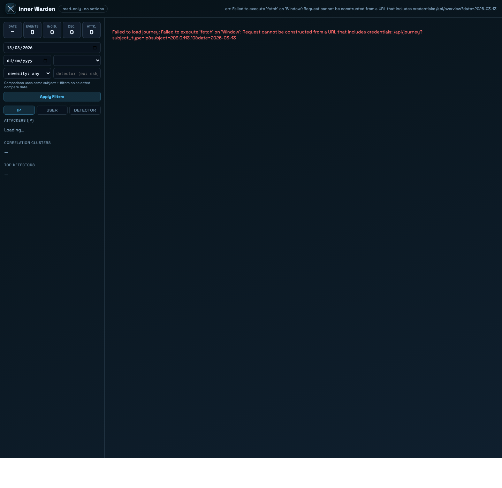
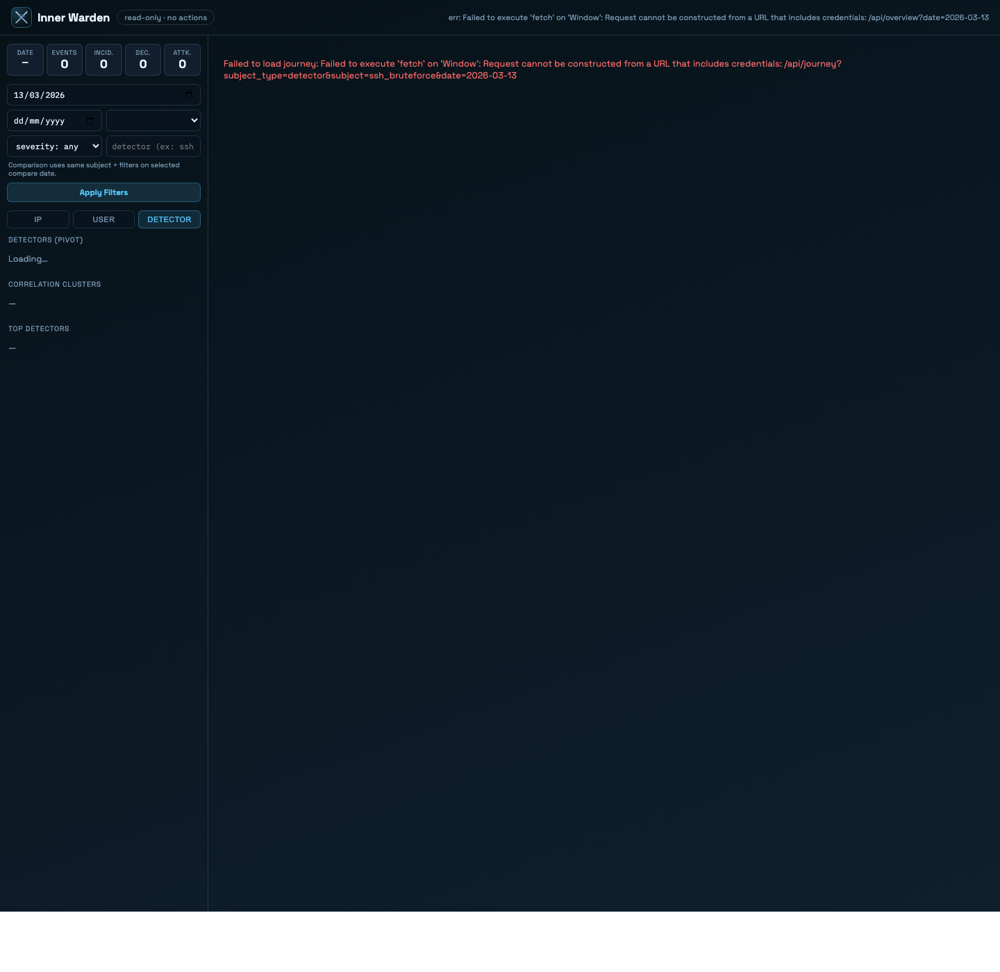

# InnerWarden

InnerWarden is a host-security observability and response system built around two Rust components:

- `innerwarden-sensor`: deterministic host telemetry collection and incident detection
- `innerwarden-agent`: incremental analysis, AI-assisted triage, dashboarding, and optional response skills

The project is designed to stay useful in safe, low-automation deployments first. The default posture is conservative:

- data collection is append-only JSONL
- responders are disabled by default
- `dry_run = true` is the recommended starting point
- privacy-sensitive collectors are explicit opt-ins

## Status

InnerWarden is an actively developed `0.x` project.

Current state:

- production-trial oriented, not yet externally audited
- single-host focus
- dashboard available for read-only local/remote investigation
- host response actions gated by config and confidence thresholds

This is not a full EDR platform, not a SIEM, and not a promise of autonomous remediation safety in every environment.

## What It Does

### Sensor — detection

The sensor collects host activity deterministically (no AI, no network calls) and runs stateful detectors:

| Detector | What it catches | Source |
|----------|----------------|--------|
| `ssh_bruteforce` | Repeated SSH login failures from the same IP | auth.log / journald |
| `credential_stuffing` | Many distinct usernames tried from one IP | auth.log / journald |
| `port_scan` | Rapid unique-port probing by source IP | firewall / kernel logs |
| `sudo_abuse` | Burst of suspicious privileged commands by a user | journald sudo |
| `search_abuse` | High-rate requests to expensive HTTP endpoints | nginx access log |
| `execution_guard` | Suspicious command execution patterns using AST analysis | auditd EXECVE + journald sudo |

**execution_guard** uses [tree-sitter-bash](https://github.com/tree-sitter/tree-sitter-bash) to parse commands structurally rather than with regex. It detects pipelines like `curl | sh`, execution from `/tmp`, reverse shell patterns, obfuscated commands, script persistence, and staged attack sequences (download → chmod → execute) across a per-user rolling window.

All collectors are fail-open: errors are logged and never crash the sensor.

### Sensor — collection

- tails `/var/log/auth.log` and parses SSH auth activity
- reads `journald` for `sshd`, `sudo`, `kernel`, or any configured unit
- optionally ingests `auditd` EXECVE records (command execution trail)
- optionally ingests `auditd` TTY records (keyboard input — explicit opt-in, privacy-sensitive)
- watches Docker lifecycle events
- polls file integrity with SHA-256
- tails nginx access logs for HTTP-layer detection
- emits normalized `events-YYYY-MM-DD.jsonl` and `incidents-YYYY-MM-DD.jsonl`

### Agent — analysis and response

- reads JSONL incrementally via byte-offset cursors (no re-read on restart)
- applies an algorithmic gate before any AI call (severity, private IP, already-blocked)
- correlates incidents in a short time window and clusters them for AI context
- supports OpenAI, Anthropic, and Ollama as AI providers (AI is optional)
- writes append-only `decisions-YYYY-MM-DD.jsonl` and `telemetry-YYYY-MM-DD.jsonl`
- generates daily narrative summaries
- serves a read-only authenticated dashboard with attacker journey investigation
- executes bounded response skills when explicitly enabled

### Modules

Detectors and skills are organized into modules — vertical solutions for a specific threat class:

| Module | What it covers |
|--------|---------------|
| `ssh-protection` | SSH brute-force + credential stuffing → block-ip |
| `network-defense` | Port scan detection → block-ip |
| `sudo-protection` | Sudo abuse → suspend-user-sudo |
| `execution-guard` | Command execution AST analysis → suspicious_execution incidents |
| `file-integrity` | SHA-256 file monitoring → webhook alert |
| `container-security` | Docker lifecycle events (observability) |
| `search-protection` | nginx access log → search_abuse → block-ip |
| `threat-capture` | monitor-ip + honeypot (Premium) |

```bash
innerwarden list                  # list all capabilities and modules
innerwarden enable block-ip       # enable block-ip (ufw backend by default)
innerwarden enable sudo-protection
innerwarden module validate ./modules/execution-guard
```

## Architecture

```text
Host Activity
  -> innerwarden-sensor
     -> events-YYYY-MM-DD.jsonl
     -> incidents-YYYY-MM-DD.jsonl
  -> innerwarden-agent
     -> decisions-YYYY-MM-DD.jsonl
     -> telemetry-YYYY-MM-DD.jsonl
     -> summary-YYYY-MM-DD.md
     -> local dashboard / report output
```



## Supported Environments

Current support target:

- Linux hosts with `systemd`
- Ubuntu 22.04 is the primary production-trial reference environment

Local development works well anywhere Rust and the required tooling are available, but install, service, and privileged response flows are Linux-first.

## Project Maturity

Treat the project as:

- `0.x` and still evolving
- trial-ready for careful operators
- not externally audited
- optimized for single-host deployments first
- conservative by default, especially around automated response

## Safety Model

Before using this outside local testing, read these guardrails carefully:

- response skills are optional and config-gated (`responder.enabled = false` by default)
- `dry_run = true` should be your default during rollout
- shell audit via `auditd` is privacy-sensitive — only enable with explicit host-owner authorization
- `execution_guard` uses AST-based detection; no blocking occurs in `observe` mode
- honeypot features are bounded and opt-in, but still require operational judgment
- AI is advisory unless you explicitly allow auto-execution and accept the configured confidence threshold

## Quickstart

### 1. Build and test

```bash
make test
make build
```

### 2. Run locally with fixture config

```bash
make run-sensor
make run-agent
```

The sensor writes to `./data/` and the agent reads from the same directory.

### 3. Start the dashboard

```bash
innerwarden-agent --dashboard-generate-password-hash
export INNERWARDEN_DASHBOARD_USER=admin
export INNERWARDEN_DASHBOARD_PASSWORD_HASH='$argon2id$...'
make run-dashboard
```

Default dashboard address: `http://127.0.0.1:8787`

The dashboard is read-only, but authentication is mandatory.

You can deep-link dashboard state through query parameters for reproducible investigations:

```text
/?date=2026-03-13&subject_type=ip&subject=203.0.113.10&window_seconds=300
```

## Dashboard Preview

Overview:



Attacker journey:



Cluster-first investigation:



## Trial Install on Linux

A guided installer is available for systemd-based Linux hosts:

```bash
./install.sh
```

What it does:

- downloads pre-compiled release binaries (or builds from source with `INNERWARDEN_BUILD_FROM_SOURCE=1`)
- installs `innerwarden-sensor`, `innerwarden-agent`, and `innerwarden` (the control CLI)
- creates `/etc/innerwarden/{config.toml,agent.toml,agent.env}`
- creates and enables systemd units
- starts in a conservative trial profile (`responder.enabled = false`, `dry_run = true`)
- prompts for privacy consent before enabling shell audit features

Recommended first rollout posture:

- `responder.enabled = false`
- `dry_run = true`
- dashboard auth configured before exposing the service remotely

## Safe Update Path

To update an existing server deployment:

```bash
make rollout-precheck HOST=user@server
make deploy HOST=user@server
ssh user@server "sudo systemctl restart innerwarden-agent innerwarden-sensor"
make rollout-postcheck HOST=user@server
```

Fast rollback:

```bash
make rollout-rollback HOST=user@server
```

Or using the built-in upgrade command:

```bash
innerwarden upgrade          # fetches and installs the latest release
innerwarden upgrade --check  # checks for updates without installing
```

## Distribution Model

Current public distribution:

- install from pre-compiled release binaries via `./install.sh`
- or build from source with `cargo build --release`
- update deployed hosts with `make deploy` + service restart, or `innerwarden upgrade`

Publishing crates to crates.io is not part of the initial public launch plan.

## Versioning Policy

InnerWarden is currently versioned as `0.x`.

Implications:

- expect change while the product and operational model are still settling
- prefer pinning a commit or release tag for repeatable deployments
- read changelog entries and rollout notes before upgrading production-trial hosts

## FAQ

### Is this an EDR?

No. It is a focused host-security observability and response project with append-only artifacts, bounded investigation features, and optional response skills.

### Does it block by default?

No. The safe starting posture is `responder.enabled = false` and `dry_run = true`.

### Do I need OpenAI to use it?

No. Collection, detection, JSONL artifacts, reports, and dashboarding all work without AI. The AI provider is only needed for the AI-assisted decision layer, which is optional.

### What does execution_guard do?

It monitors command execution events (`auditd` EXECVE records and `sudo` audit trail) and detects suspicious patterns using structural AST analysis via tree-sitter-bash. In `observe` mode (the only mode in v0.1), it detects and emits incidents — no automatic blocking occurs. Future modes (`contain`, `strict`) will add optional automated response.

### Can I use it without honeypot features?

Yes. Honeypot behavior is optional and config-gated.

### Can I add custom detectors or skills?

Yes. The module system allows packaging custom collectors, detectors, and skills as modules. See [docs/module-authoring.md](docs/module-authoring.md) for the authoring guide.

## Repository Guide

- [docs/index.md](docs/index.md) — documentation map
- [CHANGELOG.md](CHANGELOG.md) — release notes and notable changes
- [CONTRIBUTING.md](CONTRIBUTING.md) — contributor workflow
- [SECURITY.md](SECURITY.md) — vulnerability reporting guidance
- [docs/format.md](docs/format.md) — JSONL event and incident schemas
- [docs/development-plan.md](docs/development-plan.md) — roadmap and phase history
- [docs/module-authoring.md](docs/module-authoring.md) — guide for building custom modules
- [CLAUDE.md](CLAUDE.md) — maintainer-oriented operating document (kept in-repo for continuity)

## License

MIT. See [LICENSE](LICENSE).
